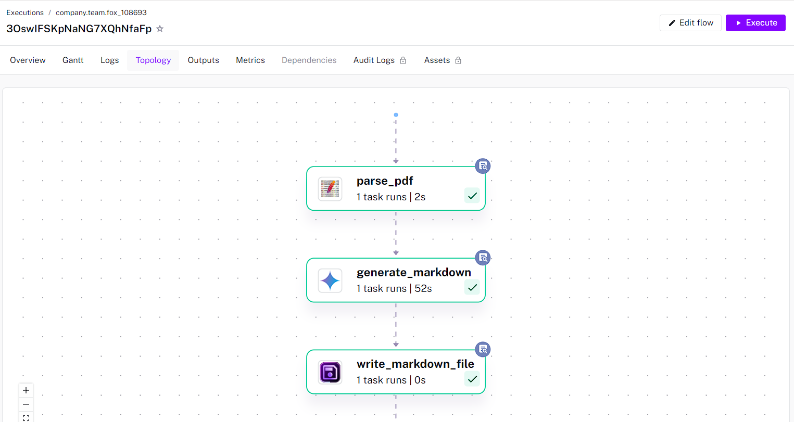
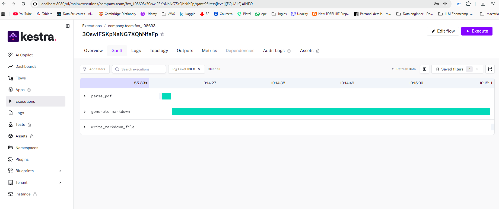
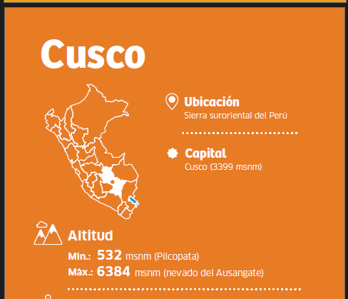
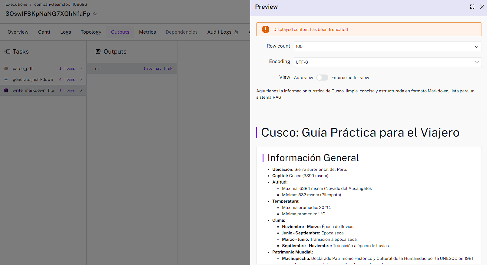

# DATA PROCESSING

**PROMPERÚ Tourism Repository – Official collection** of open-access tourism guides and publications from PROMPERÚ, covering Peru's destinations, attractions, culture, gastronomy, and travel information. Used as the primary knowledge base for the RAG application.

Source: https://repositorio.promperu.gob.pe/browse/title?scope=62ddc06f-f2d5-4a5b-9b37-3f22dfaa64cc&bbm.page=1

## GENERATING THE MD FILES

For this purpose we use Kestra workflow, the Flow Code generated by Copilot is:

```
id: fox_108693
namespace: company.team

# This flow requires Tesseract OCR to be installed on the Kestra host
# for effective text extraction from images within the PDF.
# For example, on Debian/Ubuntu: `apt-get install tesseract-ocr tesseract-ocr-spa`
# And ensure 'GEMINI_API_KEY' is configured as a Kestra secret.
inputs:
  - id: pdfFile
    type: FILE
    description: The PDF file to process.

tasks:
  - id: parse_pdf
    type: io.kestra.plugin.tika.Parse
    description: Extract text from the uploaded PDF, including OCR for images.
    from: "{{ inputs.pdfFile }}"
    contentType: TEXT
    extractEmbedded: true
    ocrOptions:
      strategy: NO_OCR
      language: spa # Specify Spanish language for OCR
    store: false # Get the content directly as output

  - id: generate_markdown
    type: io.kestra.plugin.gemini.MultimodalCompletion
    description: Clean, organize, and generate a markdown file in Spanish from the extracted text.
    apiKey: "{{ secret('GEMINI_API_KEY') }}"
    model: "gemini-2.5-flash" # Using a powerful model for text generation and cleaning
    contents:
      - role: user
        content: |
          You are an expert in summarizing and organizing tourism information into clear, concise, and well-structured markdown. 
          The following text is extracted from a PDF document about a city in Peru. It may contain some noise, non-existent words, or non-sense structures due to extraction. 
          Your task is to clean this text thoroughly, extract all relevant information about the city, its attractions, places to visit, cultural aspects, and any other useful tourism details. 
          Organize this information into a comprehensive markdown file, ensuring the output is entirely in Spanish, perfectly clean, logical, and well-structured with appropriate headings, subheadings, bullet points, and paragraphs. 
          Focus on creating a high-quality knowledge base entry suitable for a Retrieval-Augmented Generation (RAG) system.

          Here is the extracted text:
          ---
          {{ outputs.parse_pdf.result.content }}
          ---

  - id: write_markdown_file
    type: io.kestra.plugin.core.storage.Write
    description: Write the generated markdown content to a file in Kestra's internal storage.
    content: "{{ outputs.generate_markdown.text }}"
    extension: .md

outputs:
  - id: markdown_uri
    type: URI
    value: "{{ outputs.write_markdown_file.uri }}"
    description: The URI of the generated markdown file in Kestra's internal storage.
```

## GENERATED TOPOLOGY



## RUN PROCESS



## INPUT



## OUTPUT

